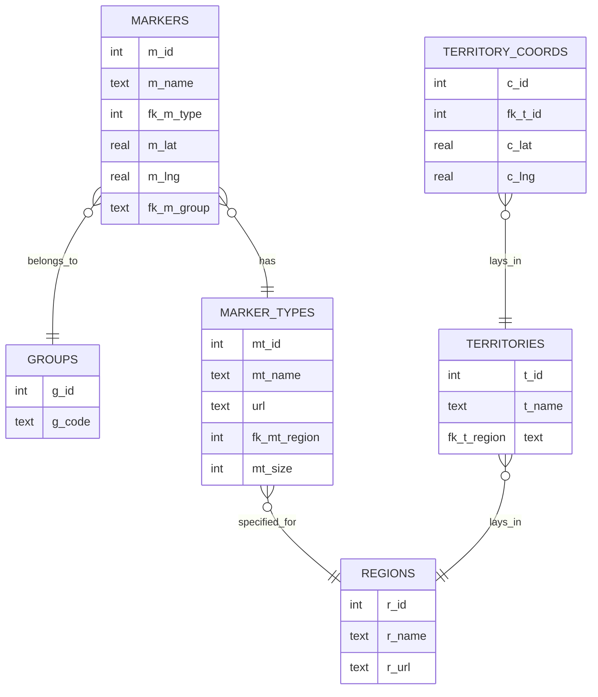

<p align="center"><br><br></p>

<h2 align="center">Faergria Interactive Map</h2>
<p align="center"><strong><code>faergriaMap</code></strong></p>
<p align="center">Eine interaktive Karte begleitend für eine Tabletop RPG Kampgne auf dem fiktiven Kontinent Faergria</p>
<br>
<p align="center">
  
</p>

<p align="center"><br><br></p>

<h2>Table of Contents</h3>

<!-- TOC -->
  * [1. Einleitung](#1-einleitung)
  * [2. Mitwirkende](#2-mitwirkende)
  * [3. Userguide](#3-userguide)
    * [a. Installation](#a-installation)
    * [b. Ausführen der Applikation](#b-ausführen-der-applikation)
    * [c. Nutzung der interaktiven Karte](#c-nutzung-der-interaktiven-karte)
  * [4. Dokumentation](#4-dokumentation)
    * [a. Verwendete Technologien](#a-verwendete-technologien)
      * [i. Frontend-Entwicklung](#i-frontend-entwicklung)
      * [ii. Kartentechnologie](#ii-kartentechnologie)
      * [iii. Backend-Entwicklung](#iii-backend-entwicklung)
      * [iv. Datenbank](#iv-datenbank)
    * [b. Architektur](#b-architektur)
      * [i. Single Page Application (SPA)](#i-single-page-application-spa)
      * [ii. Vue.js und Reaktivität](#ii-vuejs-und-reaktivität)
      * [iii. Backend und Datenbank](#iii-backend-und-datenbank)
      * [iv. API und Event Handling](#iv-api-und-event-handling)
    * [c. Datenbankmodell](#c-datenbankmodell)
  * [5. Business Case](#5-business-case)
    * [a. Executive Summary](#a-executive-summary)
    * [b. Marktanalyse](#b-marktanalyse)
    * [c. Wettbewerbsanalyse](#c-wettbewerbsanalyse)
    * [d. Geschäftsmodell](#d-geschäftsmodell)
    * [e. Marketing- und Vertriebsstrategie](#e-marketing--und-vertriebsstrategie)
<!-- TOC -->

## 1. Einleitung

<p style="text-align: justify">
Die Website stellt eine interaktive Karte als Begleitung für eine Dungeons & Dragons Kampagne dar. Die Spieler sollen
in der Lage sein, Marker für Orte auf der Karte des fiktiven Kontinents Faergria anzusehen und eigene Marker zur
Orientierung während dem Spielen setzen und bearbeiten können. Zur weiteren Orientierung auf dem fiktiven Kontinent,
sollen die Spieler die verschiedenen Regionen übersichtlich einsehen können.
</p>

## 2. Mitwirkende

| Mitwirkende              | GitHub                                                                                                                                                                                 |
|--------------------------|----------------------------------------------------------------------------------------------------------------------------------------------------------------------------------------|
| Luke Grasser<br/>(Zetsu) | <a href="https://github.com/zetsuboushii"><br/>[@Zetsuboushii](https://github.com/zetsuboushii) |

## 3. Userguide

Im Folgenden wird das grundlegende Setup, sowie die Bedienelemente der Anwendung erklärt.

### a. Installation

_Zum Ausführen wird Node.js mit npm benötigt._

Zu Beginn das Projekt klonen und folgende Befehle ausführen:

```bash
npm install
```

### b. Ausführen der Applikation

```bash
npm run start
```

_Die Karte ist gelegentlich unter [faergriamap.zetsuboushii.site](http://faergriamap.zetsuboushii.site/) erreichbar._

### c. Nutzung der interaktiven Karte

<p style="text-align: justify">
Beim Aufruf der Website wird der Nutzer direkt auf der interaktiven Karte begrüßt. Die Bedienung der Karte ist intuitiv
gestaltet: Mit dem Mausrad kann der Nutzer stufenlos hinein- und herauszoomen, und durch Ziehen mit der gedrückten
Maustaste lässt sich die Karte navigieren. Die Marker passen sich jeder Zoomstufe dynamisch an, sodass auch Cluster von
Markern bei höheren Zoomstufen deutlich erkennbar bleiben.
<br>
Auf der Karte sind die Regionen farblich markiert. Wenn der Nutzer mit der Maus über eine Region fährt, wird der Name
der Region am oberen Bildschirmrand angezeigt.
<br>
Ein Klick auf einen beliebigen Punkt der Karte öffnet auf der rechten Bildschirmseite einen Drawer. Hier kann der Nutzer
den Namen und das Icon eines Markers festlegen und diesen der Karte hinzufügen. Markierungen können bearbeitet werden,
sofern der Nutzer die entsprechenden Berechtigungen besitzt. Beim Hovern über einen Marker erscheint dessen Name als
Tooltip.
<br>
Am linken Bildschirmrand befindet sich eine scrollbare Legende, die die Farben der Regionen und deren geopolitische
Zugehörigkeit anzeigt. Ein ausfahrbares Optionsfenster ermöglicht es, einen Sessioncode einzugeben, um eigene Marker
hinzuzufügen. Zusätzlich gibt es eine Togglebox, mit der die Anzeige der Regionen ein- oder ausgeschaltet werden kann.
<br>
Sessions sind dazu gedacht, dass sich Gruppen, hauptsächlich Spielergruppen, ein eigenes Set an Markern teilen können.
Vom Dungeon Master festgelegte Marker sind nicht bearbeitbar.
<br>
Wenn ein Marker per Linksklick ausgewählt wurde, kann ein zweiter Marker per Rechtsklick angewählt werden, um eine Linie
zwischen diesen zu ziehen. Am unteren Bildschirmrand wird dann die Distanz zwischen den beiden Markern angezeigt.
</p>

## 4. Dokumentation

Im Folgenden wird das Projekt aus technischer Sicht näher beleuchtet.

### a. Verwendete Technologien

<p style="text-align: justify">
Dieses Webprojekt wurde mit einer Vielzahl moderner Technologien realisiert, um eine leistungsfähige und
benutzerfreundliche Anwendung zu erstellen. Im Folgenden werden die verwendeten Technologien ausführlicher beschrieben:
</p>

#### i. Frontend-Entwicklung

**Vue.js mit TypeScript**
<p style="text-align: justify">
Für das Frontend wurde das client-side Framework Vue.js verwendet, welches bekannt für seine Reaktivität und Modularität
ist. Die Entscheidung, Vue.js mit TypeScript zu kombinieren, ermöglicht es, die Vorteile von Typüberprüfung und modernen
JavaScript-Funktionen zu nutzen, was zu einer stabileren und wartbareren Codebasis führt. TypeScript bietet zudem eine
verbesserte Entwicklererfahrung durch besseren Code-Editor-Support und frühzeitige Fehlererkennung.
</p>

**Vuetify**
<p style="text-align: justify">
Um die Benutzeroberfläche zu gestalten und konsistente, ästhetisch ansprechende Komponenten zu verwenden, wurde das
Component Framework Vuetify integriert. Vuetify basiert auf Material Design Richtlinien und bietet eine breite Palette
an vorgefertigten UI-Komponenten, die leicht anzupassen sind. Dies beschleunigt die Entwicklung und gewährleistet eine
einheitliche Benutzererfahrung.
</p>

#### ii. Kartentechnologie

**Leaflet und vue-leaflet**
<p style="text-align: justify">
Die Kartendarstellung und -interaktion innerhalb der Anwendung wird durch die JavaScript-Bibliothek Leaflet ermöglicht.
Leaflet ist bekannt für seine Leistungsfähigkeit und Flexibilität im Umgang mit interaktiven Karten. Um Leaflet nahtlos
in das Vue-Framework zu integrieren, wird das vue-leaflet Package verwendet, das Leaflet-Funktionalitäten in Form von
Vue-Komponenten zur Verfügung stellt. Dies ermöglicht eine einfache und effiziente Implementierung von Kartenfunktionen
in der Anwendung.
</p>

#### iii. Backend-Entwicklung

**ExpressJS**
<p style="text-align: justify">
Der Server wird mit ExpressJS realisiert, einem minimalen und flexiblen Node.js-Web-Application-Framework, das robuste
Features für Web- und Mobilanwendungen bietet. ExpressJS dient als Middleware-Schicht, die Anfragen verarbeitet, Routing
durchführt und als Kommunikationsbrücke zwischen dem Frontend und der Datenbank fungiert.
</p>

#### iv. Datenbank

**SQLite**
<p style="text-align: justify">
Die Datenhaltung wird durch eine SQLite-Datenbank gelöst. SQLite ist eine leichtgewichtige, dateibasierte Datenbank, die
sich besonders gut für lokale Anwendungen eignet. Sie benötigt keinen separaten Server und ist einfach zu konfigurieren
und zu verwalten. SQLite bietet dennoch ausreichende Leistungsfähigkeit und Funktionalität für viele Anwendungsfälle,
insbesondere für kleinere bis mittelgroße Projekte.
</p>

### b. Architektur

<p style="text-align: justify">
Für dieses Projekt wurde die Entscheidung getroffen, eine Single Page Application (SPA) zu entwickeln. Der Hauptgrund
hierfür ist die einzige statische Ansicht der Karte, auf der dynamisch Elemente ein- und ausgeblendet werden können.
Eine SPA bietet mehrere Vorteile, insbesondere im Hinblick auf Leistung und Benutzererfahrung. Durch das Laden aller
erforderlichen Ressourcen auf einmal und das anschließende dynamische Aktualisieren des Inhalts wird die Notwendigkeit
ständiger Seitenneuladungen eliminiert, was zu einer schnelleren und flüssigeren Interaktion führt.
</p>

#### i. Single Page Application (SPA)

<p style="text-align: justify">
Eine SPA lädt initial eine HTML-Seite und aktualisiert den Inhalt dynamisch durch JavaScript, ohne die Seite neu zu
laden. Dies ermöglicht eine reibungslose und responsive Benutzererfahrung, da nur die notwendigen Teile der Seite
aktualisiert werden, anstatt den gesamten Inhalt neu zu laden. Dadurch werden die Serverlast und die Ladezeiten
reduziert, was zu einer verbesserten Performance führt.
</p>

#### ii. Vue.js und Reaktivität

<p style="text-align: justify">
Vue.js wurde als Framework gewählt, da es eine kleinteilige Komponentenstruktur ermöglicht. Diese Struktur erlaubt es,
Frontendelemente in separate, wiederverwendbare Komponenten auszulagern. Zu den Hauptkomponenten gehören:
</p>

- **MapView**: Die Hauptansicht, in der die Karte und andere dynamische Vue-Komponenten wie der MarkerInfoDrawer
  gerendert werden.
- **MarkerInfoDrawer**: Eine seitlich ein- und ausfahrbare Komponente, die Informationen zu den Markern anzeigt und
  deren Bearbeitung ermöglicht.

<p style="text-align: justify">
Vue.js ist bekannt für seine Reaktivität. Wenn sich der Zustand der Anwendung ändert, aktualisiert Vue automatisch die
betroffenen Teile der Benutzeroberfläche. Dies macht die Entwicklung effizienter und die Anwendung reaktionsschneller.
Reaktive Datenbindungen sorgen dafür, dass Änderungen im Datenmodell sofort im UI reflektiert werden, ohne dass explizit
DOM-Manipulationen durchgeführt werden müssen.
</p>

#### iii. Backend und Datenbank

<p style="text-align: justify">
Die Datenbank, in der unter anderem Informationen über Marker gespeichert werden, wird von einem Server gehostet und auf
einem spezifischen Port bereitgestellt. Die Datenbank verwendet SQLite, eine leichtgewichtige, dateibasierte
Datenbanklösung. Der Zugriff auf die Datenbank erfolgt über eine eigens entwickelte API. Diese API stellt dem Frontend
Funktionen und Variablen zur Verfügung, um Daten aus der Datenbank abzurufen und zu verwenden. Dies ermöglicht eine
klare Trennung zwischen Frontend und Backend, wodurch die Wartbarkeit und Skalierbarkeit der Anwendung verbessert wird.
</p>

#### iv. API und Event Handling

<p style="text-align: justify">
Zusätzlich zur Datenbank-API existiert eine weitere API, die für das Handling von Events, State Changes und Berechnungen
zuständig ist. Diese API ermöglicht es, auf Benutzerinteraktionen zu reagieren und die Anwendung entsprechend
anzupassen. Beispiele hierfür sind das Hinzufügen oder Bearbeiten von Markern auf der Karte und das Berechnen von
Distanzen zwischen Markern. Durch die Verwendung von APIs wird die Modularität und Erweiterbarkeit der Anwendung
gewährleistet.
</p>

### c. Datenbankmodell

<p style="text-align: justify">
Das Datenbankmodell zeigt die Struktur einer relationalen Datenbank, die für eine Anwendung zur Verwaltung von Markern
und Regionen auf einer Karte verwendet wird. Die Datenbank besteht aus sechs Tabellen, die durch verschiedene
Beziehungen miteinander verknüpft sind.
</p>



`GROUPS`

- **Attribute:**
    - `g_id` (int): Primärschlüssel, der die Gruppe eindeutig identifiziert.
    - `g_code` (text): Ein Code, der zur Identifizierung der Gruppe verwendet wird.
- **Beziehungen:**
    - Eine Gruppe kann mehrere Marker haben (`belongs_to` Beziehung zu MARKERS).

`MARKERS`

- **Attribute:**
    - `m_id` (int): Primärschlüssel, der den Marker eindeutig identifiziert.
    - `m_name` (text): Der Name des Markers.
    - `fk_m_type` (int): Fremdschlüssel, der auf den Typ des Markers verweist (Verbindung zu MARKER_TYPES).
    - `m_lat` (real): Die geografische Breite des Markers.
    - `m_lng` (real): Die geografische Länge des Markers.
    - `fk_m_group` (text): Fremdschlüssel, der auf die Gruppe verweist, zu der der Marker gehört (Verbindung zu GROUPS).
- **Beziehungen:**
    - Jeder Marker gehört zu einer Gruppe.
    - Jeder Marker hat einen Typ (`has` Beziehung zu MARKER_TYPES).

`MARKER_TYPES`

- **Attribute:**
    - `mt_id` (int): Primärschlüssel, der den Markertyp eindeutig identifiziert.
    - `mt_name` (text): Der Name des Markertyps.
    - `url` (text): Eine URL, die möglicherweise ein Icon oder Bild für den Markertyp enthält.
    - `fk_mt_region` (int): Fremdschlüssel, der auf die Region verweist, zu der der Markertyp gehört (Verbindung zu
      REGIONS).
    - `mt_size` (int): Die Größe des Markertyps.
- **Beziehungen:**
    - Jeder Markertyp ist für eine Region spezifiziert (`specified_for` Beziehung zu REGIONS).

`REGIONS`

- **Attribute:**
    - `r_id` (int): Primärschlüssel, der die Region eindeutig identifiziert.
    - `r_name` (text): Der Name der Region.
    - `r_url` (text): Eine URL, die möglicherweise ein Bild oder eine weitere Information zur Region enthält.
- **Beziehungen:**
    - Eine Region kann mehrere Markertypen haben.
    - Eine Region kann mehrere Territorien haben (`lays_in` Beziehung zu TERRITORIES).

`TERRITORIES`

- **Attribute:**
    - `t_id` (int): Primärschlüssel, der das Territorium eindeutig identifiziert.
    - `t_name` (text): Der Name des Territoriums.
    - `fk_t_region` (int): Fremdschlüssel, der auf die Region verweist, zu der das Territorium gehört (Verbindung zu
      REGIONS).
- **Beziehungen:**
    - Ein Territorium gehört zu einer Region.
    - Ein Territorium kann mehrere Koordinaten haben (`lays_in` Beziehung zu TERRITORY_COORDS).

`TERRITORY_COORDS`

- **Attribute:**
    - `c_id` (int): Primärschlüssel, der die Koordinate eindeutig identifiziert.
    - `fk_t_id` (int): Fremdschlüssel, der auf das Territorium verweist, zu dem die Koordinate gehört (Verbindung zu
      TERRITORIES).
    - `c_lat` (real): Die geografische Breite der Koordinate.
    - `c_lng` (real): Die geografische Länge der Koordinate.
- **Beziehungen:**
    - Eine Koordinate gehört zu einem Territorium.

## 5. Business Case

<p style="text-align: justify">
Im Folgenden wird der Business Case der Website im Zusammenhang mit dem aus der Faergria Suite erläutert.
</p>

### a. Executive Summary

<p style="text-align: justify">
Die Faergria Interactive Map ist eine innovative Webanwendung, die speziell für Spielergruppen von
Tabletop-Rollenspielen wie Dungeons & Dragons entwickelt wurde. Die interaktive Karte ermöglicht es den Spielern, sich
auf dem fiktiven Kontinent Faergria zu orientieren, Marker zu setzen und relevante Informationen anzuzeigen. Die
Anwendung fördert die Zusammenarbeit und das gemeinsame Erlebnis innerhalb der Spielergruppe und wird durch den Faergria
Webshop ergänzt, der eine Vielzahl an themenbezogenen Produkten anbietet.
</p>

### b. Marktanalyse

<p style="text-align: justify">
Der Markt für Tabletop-Rollenspiele und verwandte Produkte hat in den letzten Jahren ein bemerkenswertes Wachstum
erfahren. Mit dem Aufschwung von Online-Communities und Streaming-Plattformen hat sich die Spielerbasis deutlich
vergrößert. Es gibt eine hohe Nachfrage nach unterstützenden Tools und Anwendungen, die das Spielerlebnis verbessern.
Die Faergria Interactive Map bedient diese Nachfrage, indem sie eine benutzerfreundliche und funktionsreiche Plattform
bereitstellt, die nahtlos in die bestehenden Spielrunden integriert werden kann.
</p>

### c. Wettbewerbsanalyse

<p style="text-align: justify">
Die Faergria Interactive Map steht in Konkurrenz zu anderen Karten- und Spielmanagement-Tools wie Roll20, Fantasy
Grounds und D&D Beyond. Diese Plattformen bieten umfassende Lösungen für das Online-Spielen, einschließlich
Kartenverwaltung, Charakterbögen und mehr. Die Faergria Interactive Map unterscheidet sich durch ihren Fokus auf
Einfachheit und Benutzerfreundlichkeit sowie die spezielle Anpassung an die Bedürfnisse von Dungeons & Dragons-Spielern.
Darüber hinaus bietet die Integration mit dem Faergria Webshop einen zusätzlichen Mehrwert, indem themenbezogene
Produkte direkt in die Spielerfahrung eingebunden werden.
</p>

### d. Geschäftsmodell

<p style="text-align: justify">
Das Geschäftsmodell der Faergria Interactive Map basiert auf der Verkauf von physischen und digitalen Produkten über den
Faergria Webshop eine weitere Einnahmequelle darstellen. Dies umfasst exklusive Karten, Spielzubehör und themenbezogene
Merchandise-Artikel.
</p>

### e. Marketing- und Vertriebsstrategie

Die Marketingstrategie für die Faergria Interactive Map konzentriert sich auf mehrere Kernbereiche:

1. **Online-Präsenz**: Aufbau einer starken Online-Präsenz durch Social Media, Blogs und Foren, um die Zielgruppe direkt
   anzusprechen.
2. **Community-Engagement**: Förderung einer aktiven Community durch regelmäßige Updates, Feedback-Runden und exklusive
   Inhalte.
3. **Cross-Promotion**: Nutzung des Faergria Webshops zur Cross-Promotion der interaktiven Karte und umgekehrt, um die
   Kundenbasis zu erweitern.

Faergria © Zetsu 2024
