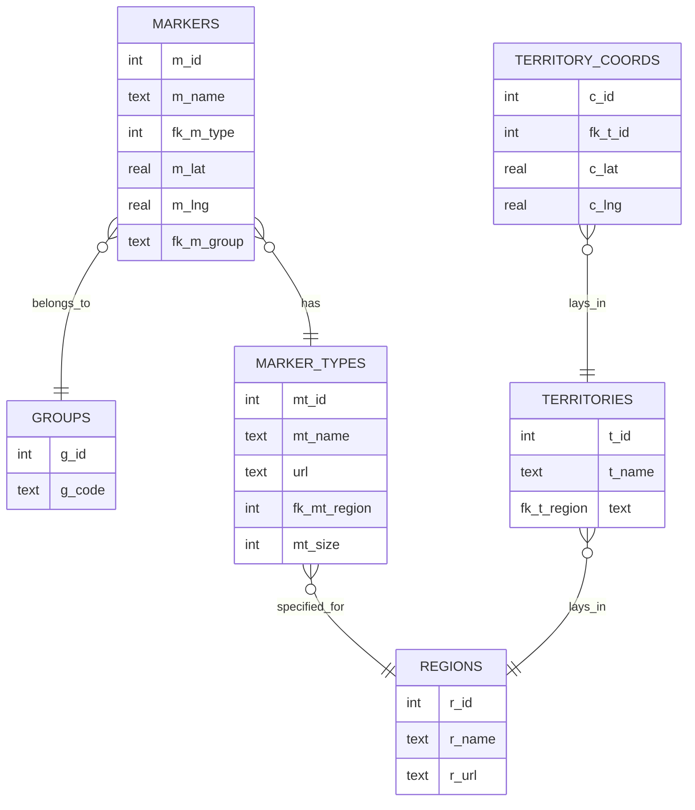

<p align="center"><br><br></p>

<h2 align="center">Faergria Interactive Map</h2>
<p align="center"><strong><code>faergriaMap</code></strong></p>
<p align="center">Eine interaktive Karte begleitend für eine Tabletop RPG Kampgne auf dem fiktiven Kontinent Faergria</p>
<br>
<p align="center">
  
</p>

<p align="center"><br><br></p>

<h2>Table of Contents</h3>

<!-- TOC -->

* [1. Einleitung](#1-einleitung)
* [2. Mitwirkende](#2-mitwirkende)
* [3. Userguide](#3-userguide)
    * [a. Installation](#a-installation)
    * [b. Ausführen der Applikation](#b-ausführen-der-applikation)
    * [c. Nutzung der interaktiven Karte](#c-nutzung-der-interaktiven-karte)
* [4. Dokumentation](#4-dokumentation)
    * [a. Verwendete Technologien](#a-verwendete-technologien)
        * [i. Frontend-Entwicklung](#i-frontend-entwicklung)
        * [ii. Kartentechnologie](#ii-kartentechnologie)
        * [iii. Backend-Entwicklung](#iii-backend-entwicklung)
        * [iv. Datenbank](#iv-datenbank)
    * [b. Architektur](#b-architektur)
    * [c. Datenbankmodell](#c-datenbankmodell)
* [5. Business Case](#5-business-case)
    * [a. Executive Summary](#a-executive-summary)
    * [b. Marktanalyse](#b-marktanalyse)
    * [c. Wettbewerbsanalyse](#c-wettbewerbsanalyse)
    * [d. Geschäftsmodell](#d-geschäftsmodell)
    * [e. Marketing- und Vertriebsstrategie](#e-marketing--und-vertriebsstrategie)

<!-- TOC -->

## 1. Einleitung

## 2. Mitwirkende

| Mitwirkende              | GitHub                                                                                                                                                                                 |
|--------------------------|----------------------------------------------------------------------------------------------------------------------------------------------------------------------------------------|
| Luke Grasser<br/>(Zetsu) | <a href="https://github.com/zetsuboushii"><br/>[@Zetsuboushii](https://github.com/zetsuboushii) |

## 3. Userguide

Im Folgenden wird das Grundlegende Setup, sowie die Bedienelemente der Anwendung erklärt.

### a. Installation

_Zum Ausführen wird Node.js mit npm benötigt._

Zu Beginn das Projekt klonen und folgende Befehle ausführen:

```bash
npm install
```

### b. Ausführen der Applikation

```bash
npm run start
```

_Die Karte ist während begrenzten Zeitrahmen unter xxx erreichbar._

### c. Nutzung der interaktiven Karte

<div style="text-align: justify">
Beim Aufruf der Website wird der Nutzer direkt auf der interaktiven Karte begrüßt. Die Bedienung der Karte ist intuitiv
gestaltet: Mit dem Mausrad kann der Nutzer stufenlos hinein- und herauszoomen, und durch Ziehen mit der gedrückten
Maustaste lässt sich die Karte navigieren. Die Marker passen sich jeder Zoomstufe dynamisch an, sodass auch Cluster von
Markern bei höheren Zoomstufen deutlich erkennbar bleiben.

Auf der Karte sind die Regionen farblich markiert. Wenn der Nutzer mit der Maus über eine Region fährt, wird der Name
der Region am oberen Bildschirmrand angezeigt.

Ein Klick auf einen beliebigen Punkt der Karte öffnet auf der rechten Bildschirmseite einen Drawer. Hier kann der Nutzer
den Namen und das Icon eines Markers festlegen und diesen der Karte hinzufügen. Markierungen können bearbeitet werden,
sofern der Nutzer die entsprechenden Berechtigungen besitzt. Beim Hovern über einen Marker erscheint dessen Name als
Tooltip.

Am linken Bildschirmrand befindet sich eine scrollbare Legende, die die Farben der Regionen und deren geopolitische
Zugehörigkeit anzeigt. Ein ausfahrbares Optionsfenster ermöglicht es, einen Sessioncode einzugeben, um eigene Marker
hinzuzufügen. Zusätzlich gibt es eine Togglebox, mit der die Anzeige der Regionen ein- oder ausgeschaltet werden kann.

Sessions sind dazu gedacht, dass sich Gruppen, hauptsächlich Spielergruppen, ein eigenes Set an Markern teilen können.
Vom Dungeon Master festgelegte Marker sind nicht bearbeitbar.

Wenn ein Marker per Linksklick ausgewählt wurde, kann ein zweiter Marker per Rechtsklick angewählt werden, um eine Linie
zwischen diesen zu ziehen. Am unteren Bildschirmrand wird dann die Distanz zwischen den beiden Markern angezeigt.
</div>

## 4. Dokumentation

Im Folgenden wird das Projekt aus technischer Sicht näher beleuchtet.

### a. Verwendete Technologien

Dieses Webprojekt wurde mit einer Vielzahl moderner Technologien realisiert, um eine leistungsfähige und
benutzerfreundliche Anwendung zu erstellen. Im Folgenden werden die verwendeten Technologien ausführlicher beschrieben:

#### i. Frontend-Entwicklung

**Vue.js mit TypeScript**  
Für das Frontend wurde das client-side Framework Vue.js verwendet, welches bekannt für seine Reaktivität und Modularität
ist. Die Entscheidung, Vue.js mit TypeScript zu kombinieren, ermöglicht es, die Vorteile von Typüberprüfung und modernen
JavaScript-Funktionen zu nutzen, was zu einer stabileren und wartbareren Codebasis führt. TypeScript bietet zudem eine
verbesserte Entwicklererfahrung durch besseren Code-Editor-Support und frühzeitige Fehlererkennung.

**Vuetify**  
Um die Benutzeroberfläche zu gestalten und konsistente, ästhetisch ansprechende Komponenten zu verwenden, wurde das
Component Framework Vuetify integriert. Vuetify basiert auf Material Design Richtlinien und bietet eine breite Palette
an vorgefertigten UI-Komponenten, die leicht anzupassen sind. Dies beschleunigt die Entwicklung und gewährleistet eine
einheitliche Benutzererfahrung.

#### ii. Kartentechnologie

**Leaflet und vue-leaflet**  
Die Kartendarstellung und -interaktion innerhalb der Anwendung wird durch die JavaScript-Bibliothek Leaflet ermöglicht.
Leaflet ist bekannt für seine Leistungsfähigkeit und Flexibilität im Umgang mit interaktiven Karten. Um Leaflet nahtlos
in das Vue-Framework zu integrieren, wird das vue-leaflet Package verwendet, das Leaflet-Funktionalitäten in Form von
Vue-Komponenten zur Verfügung stellt. Dies ermöglicht eine einfache und effiziente Implementierung von Kartenfunktionen
in der Anwendung.

#### iii. Backend-Entwicklung

**ExpressJS**  
Der Server wird mit ExpressJS realisiert, einem minimalen und flexiblen Node.js-Web-Application-Framework, das robuste
Features für Web- und Mobilanwendungen bietet. ExpressJS dient als Middleware-Schicht, die Anfragen verarbeitet, Routing
durchführt und als Kommunikationsbrücke zwischen dem Frontend und der Datenbank fungiert.

#### iv. Datenbank

**SQLite**  
Die Datenhaltung wird durch eine SQLite-Datenbank gelöst. SQLite ist eine leichtgewichtige, dateibasierte Datenbank, die
sich besonders gut für lokale Anwendungen eignet. Sie benötigt keinen separaten Server und ist einfach zu konfigurieren
und zu verwalten. SQLite bietet dennoch ausreichende Leistungsfähigkeit und Funktionalität für viele Anwendungsfälle,
insbesondere für kleinere bis mittelgroße Projekte.

### b. Architektur

### c. Datenbankmodell



## 5. Business Case

### a. Executive Summary

### b. Marktanalyse

### c. Wettbewerbsanalyse

### d. Geschäftsmodell

### e. Marketing- und Vertriebsstrategie

Faergria © Zestu 2024 