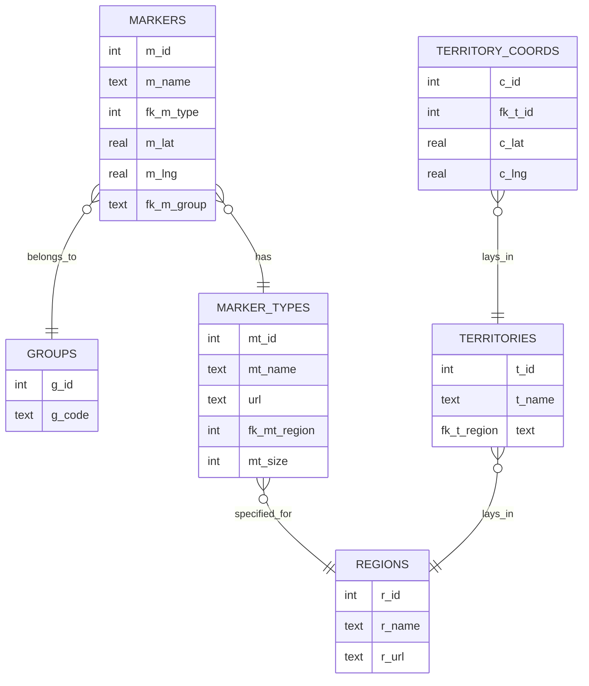

```mermaid
erDiagram
    GROUPS {
        int g_id
        text g_code
    }
    MARKER_TYPES {
        int mt_id
        text mt_name
        text url
        int fk_mt_region
        int mt_size
    }
    MARKERS {
        int m_id
        text m_name
        int fk_m_type
        real m_lat
        real m_lng
        text fk_m_group
    }
    REGIONS {
        int r_id
        text r_name
        text r_url
    }
    TERRITORIES {
        int t_id
        text t_name
        fk_t_region text
    }
    TERRITORY_COORDS {
        int c_id
        int fk_t_id
        real c_lat
        real c_lng
    }
    
    MARKERS }o--|| MARKER_TYPES : has
    MARKERS }o--|| GROUPS : belongs_to
    MARKER_TYPES }o--|| REGIONS : specified_for
    TERRITORIES }o--|| REGIONS : lays_in
    TERRITORY_COORDS }o--|| TERRITORIES : lays_in
```