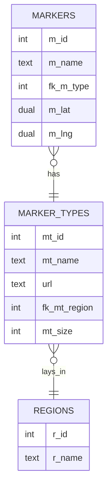

```mermaid
erDiagram
    MARKERS {
        int m_id
        text m_name
        int fk_m_type
        dual m_lat
        dual m_lng
    }
    MARKER_TYPES {
        int mt_id
        text mt_name
        text url
        int fk_mt_region
        int mt_size
    }
    REGIONS {
        int r_id
        text r_name
    }
    
    MARKERS }o--|| MARKER_TYPES : has
    MARKER_TYPES }o--|| REGIONS : lays_in
```